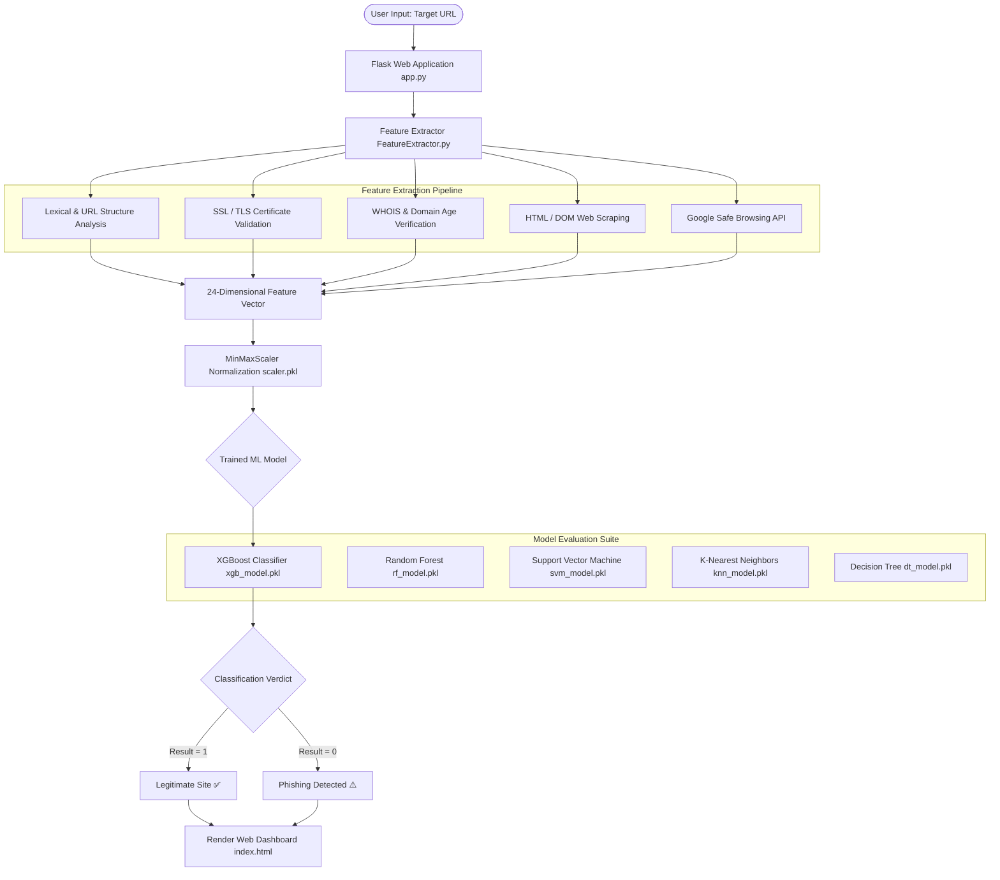

# 🛡️ Phishing Website Detection System

[](https://www.python.org/)
[](https://flask.palletsprojects.com/)
[](https://scikit-learn.org/)
[]()
[]()

An intelligent, machine-learning-driven security system designed to detect and classify phishing websites in real time. The system extracts **24 heuristic, lexical, domain, and web-content features** from any target URL and classifies it as either **Legitimate** or **Phishing** using high-performance classification models served through a modern **Flask web application**.

Developed as a Final Year Project for **CSP650 (Computing Project)** at **Universiti Teknologi MARA (UiTM)**.

---

## 📑 Table of Contents

- [Overview](#-overview)
- [System Architecture](#-system-architecture)
- [Key Features](#-key-features)
- [Extracted URL Features](#-extracted-url-features)
- [Machine Learning Models](#-machine-learning-models)
- [Project Directory Structure](#-project-directory-structure)
- [Installation & Setup](#-installation--setup)
- [Usage Guide](#-usage-guide)
  - [1. Running the Web Application](#1-running-the-web-application)
  - [2. Model Training & Evaluation](#2-model-training--evaluation)
- [Security Notice & Best Practices](#-security-notice--best-practices)
- [Future Work](#-future-work)
- [Author & Acknowledgements](#-author--acknowledgements)

---

## 🌐 Overview

Phishing attacks remain one of the most widespread cyber threats, deceiving users into disclosing confidential credentials and financial information through fraudulent websites. Traditional blacklist-based detection approaches often fail against zero-day phishing attacks and rapidly created temporary domains.

This project addresses these challenges by implementing an automated machine learning detection pipeline that:
1. Accepts raw URLs from user input.
2. Extracts comprehensive syntactic, domain registration (WHOIS), SSL certificate, and HTML content features.
3. Normalizes and scores the feature vectors using pre-trained machine learning models.
4. Returns instantaneous security verdicts via a responsive, user-friendly web interface.

---

## 🏗️ System Architecture



---

## ✨ Key Features

- **Live URL Feature Extraction**: Automatically extracts 24 critical indicators from raw URLs on the fly using network queries, WHOIS lookups, SSL handshakes, and DOM parsing.
- **Custom & Optimized ML Implementations**:
  - Custom implementations of algorithms (Decision Tree, Random Forest, K-NN, XGBoost with binary cross-entropy, and PCA) demonstrating foundational algorithmic principles.
  - Integration with tuned estimators for scalable production deployment.
- **Data Preprocessing & Class Balancing**:
  - Imbalanced class handling using **SMOTE** (Synthetic Minority Over-sampling Technique).
  - Feature normalization using **MinMaxScaler**.
- **Modern Responsive Web Interface**:
  - Built with Flask, HTML5, and CSS3.
  - Interactive design with dynamic alerts, gradient styling, input validation, and clear security verdicts.
- **Threat Intelligence Feed**:
  - Integrated with **Google Safe Browsing API (v4)** for blacklist and threat reputation checks.

---

## 🔍 Extracted URL Features

The feature extraction engine (`FeatureExtractor.py`) evaluates 24 distinct attributes, mapped to standard indicator values (`1` for Legitimate, `0` for Suspicious, `-1` for Phishing):

| # | Feature Category | Feature Name | Description / Evaluation Criteria |
|---|---|---|---|
| **1** | **Lexical / URL** | `having_IP_Address` | Checks if an IP address is used instead of a domain name (Regex matching). |
| **2** | **Lexical / URL** | `URL_Length` | Length < 54 (Legit), 54–75 (Suspicious), > 75 (Phishing). |
| **3** | **Lexical / URL** | `Shortening_Service` | Identifies URL shorteners (bit.ly, goo.gl, tinyurl, t.co, ow.ly, etc.). |
| **4** | **Lexical / URL** | `having_At_Symbol` | Checks for `@` symbol (often used to obscure target destinations). |
| **5** | **Lexical / URL** | `double_slash_redirecting` | Detects multiple `//` occurrences indicating redirect tricks. |
| **6** | **Lexical / URL** | `Prefix_Suffix` | Detects hyphens `-` in the registered domain prefix or suffix. |
| **7** | **Lexical / URL** | `having_Sub_Domain` | Counts sub-domain dots (0 dots: Legit, 1: Suspicious, >1: Phishing). |
| **8** | **Security / SSL** | `SSLfinal_State` | Validates SSL/TLS certificate issuer and validity period ($\ge 365$ days). |
| **9** | **Domain / WHOIS** | `Domain_registration_length` | Remaining domain expiration duration ($\ge 365$ days: Legit). |
| **10** | **Network / Port** | `port` | Flags open non-standard ports outside standard HTTP/HTTPS (80, 443). |
| **11** | **Lexical / URL** | `HTTPS_token` | Checks if token `https` is misleadingly placed within the sub-domain part. |
| **12** | **HTML / Content** | `Request_URL` | Ratio of external multimedia (images/scripts) hosted on different domains. |
| **13** | **HTML / Content** | `URL_of_Anchor` | Ratio of hyperlinks (`<a>`) pointing to external or null destinations. |
| **14** | **HTML / Content** | `Links_in_tags` | Ratio of external sources in `<meta>`, `<link>`, and `<script>` tags. |
| **15** | **HTML / Content** | `SFH` | Server Form Handler: Empty, `about:blank`, or third-party submission action. |
| **16** | **Lexical / URL** | `Abnormal_URL` | Hostname matching consistency with domain registration records. |
| **17** | **HTML / Content** | `Redirect` | Number of page HTTP redirect hops (>2 redirects: Phishing). |
| **18** | **Behavioral** | `on_mouseover` | Detects status bar spoofing via JavaScript `onmouseover` modifications. |
| **19** | **Behavioral** | `RightClick` | Detects disabled right-click context menu via `event.button==2`. |
| **20** | **Behavioral** | `popUpWidnow` | Identifies JavaScript alert/prompt modal pop-ups designed for input capture. |
| **21** | **HTML / Content** | `Iframe` | Detects hidden or invisible `<iframe>` embeddings without borders. |
| **22** | **Domain / WHOIS** | `age_of_domain` | Evaluates domain creation age ($\ge 180$ days: Legit). |
| **23** | **Network / DNS** | `DNSRecord` | Confirms active DNS A-Record resolution. |
| **24** | **Intelligence** | `Statistical_report` | Google Safe Browsing threat match check. |

---

## 🤖 Machine Learning Models

The repository provides training scripts and pre-trained `.pkl` models for multiple classification algorithms:

1. **XGBoost (`xgb_model.pkl`)** *(Default Deployment Model)*
   - Boosted decision tree framework using gradient and hessian calculations with binary log loss (`XGBoostSigmoid.py`, `BoostedTree.py`, `LinearBooster.py`).
   - Tuned learning rate, tree depth, and subsample ratios for optimal generalization.
2. **Random Forest (`rf_model.pkl`)**
   - Ensemble of bagged decision trees trained on bootstrap samples with majority voting.
3. **Support Vector Machine (`svm_model.pkl`)**
   - Non-linear boundary classification utilizing Radial Basis Function (RBF) kernel with optimized cost $C$ and $\gamma$.
4. **K-Nearest Neighbors (`knn_model.pkl`)**
   - Instance-based classifier supporting Euclidean, Manhattan, and Minkowski distance metrics.
5. **Decision Tree (`dt_model.pkl`)**
   - Recursive partitioning based on Gini impurity and Information Gain.
6. **Principal Component Analysis (`PCA.py`)**
   - Custom implementation for dimensionality reduction via covariance matrix computation and eigenvalue decomposition.

---

## 📁 Project Directory Structure

```text
├── models/                     # Serialized pre-trained machine learning models
│   ├── dt_model.pkl            # Trained Decision Tree model
│   ├── feature_names.pkl       # Feature name mappings
│   ├── knn_model.pkl           # Trained K-Nearest Neighbors model
│   ├── rf_model.pkl            # Trained Random Forest model
│   ├── scaler.pkl              # Fitted MinMaxScaler object
│   ├── svm_model.pkl           # Trained Support Vector Machine model
│   └── xgb_model.pkl           # Trained XGBoost model (Active in web app)
│
├── templates/                  # Frontend HTML templates
│   └── index.html              # Responsive web dashboard for URL scanning
│
├── app.py                      # Flask web application entry point & API routes
├── FeatureExtractor.py         # Live 24-feature URL extraction engine
│
├── PhishingData.csv            # Original dataset (28 features + target)
├── PhishingData2.csv           # Aligned dataset (24 extracted features + target)
│
├── DecisionTree.py             # Custom Decision Tree implementation from scratch
├── RandomForest.py             # Custom Random Forest classifier implementation
├── KNN.py                      # Custom K-Nearest Neighbors classifier
├── SVM.py                      # Support Vector Machine wrapper
├── XGBoost.py                  # Custom Gradient Boosting implementation
├── XGBoostSigmoid.py           # XGBoost with binary cross-entropy sigmoid loss
├── BoostedTree.py              # Boosted Tree node structure & split calculations
├── LinearBooster.py            # Linear booster auxiliary component
├── PCA.py                      # Custom Principal Component Analysis implementation
│
├── train.py                    # Master training pipeline & model serialization
├── train_rf.py                 # Random Forest training & hyperparameter tuning
├── train_xgboost2.py           # XGBoost training, evaluation & loss curves
├── train_dt                    # Decision Tree dedicated training script
├── train_knn                   # KNN dedicated training script
├── train_SVM                   # SVM dedicated training script
├── train_xgboost               # Standalone XGBoost training script
│
├── .gitignore                  # Git ignore rules for Python, cache, and models
├── requirements.txt            # Python dependencies and versions
└── README.md                   # Project documentation
```

---

## ⚙️ Installation & Setup

### 1. Prerequisites
- **Python 3.8 to 3.11** installed on your system.
- `pip` (Python package manager).
- Git installed.

### 2. Clone the Repository
```bash
git clone https://github.com/your-username/phishing-website-detection.git
cd phishing-website-detection
```

### 3. Set Up a Virtual Environment
It is recommended to use a virtual environment:

**On Windows (PowerShell):**
```powershell
python -m venv venv
.\venv\Scripts\Activate.ps1
```

**On macOS / Linux:**
```bash
python3 -m venv venv
source venv/bin/activate
```

### 4. Install Dependencies
```bash
pip install -r requirements.txt
```

---

## 🚀 Usage Guide

### 1. Running the Web Application

To launch the local web server:

```bash
python app.py
```

Once started, open your web browser and navigate to:
```
http://127.0.0.1:5000/
```

1. Enter any full URL (e.g., `https://google.com` or a suspicious link).
2. Click **Analyze URL**.
3. The system extracts the 24 live features, scales them, and displays the safety verdict:
   - **Legitimate Site (Safe)**: Green alert badge.
   - **Phishing Detected (Danger)**: Red alert badge with warning instructions.

---

### 2. Model Training & Evaluation

To re-train or experiment with any model:

- **Train the full pipeline:**
  ```bash
  python train.py
  ```
- **Train Random Forest with hyperparameter sweeps:**
  ```bash
  python train_rf.py
  ```
- **Train XGBoost with learning curves:**
  ```bash
  python train_xgboost2.py
  ```

Training scripts generate:
- Training and Testing Accuracy scores.
- Detailed Classification Reports (Precision, Recall, F1-Score).
- Confusion Matrix visualizations via Seaborn / Matplotlib.
- Serialized `.pkl` artifacts updated directly in `models/`.

---

## 🔐 Security Notice & Best Practices

> [!IMPORTANT]
> **API Key Safety**: In `FeatureExtractor.py`, the Google Safe Browsing API key is used for blacklist reputation queries. For production or public repositories:
> 1. Avoid hardcoding secret API keys directly in source files.
> 2. Create a `.env` file and use `python-dotenv`:
>    ```python
>    import os
>    from dotenv import load_dotenv
>    load_dotenv()
>    API_KEY = os.getenv("SAFE_BROWSING_API_KEY")
>    ```
> 3. Ensure `.env` is listed in `.gitignore`.

> [!NOTE]
> **Network Access**: Live feature extraction requires an active internet connection to perform WHOIS lookups (`python-whois`), DNS resolution (`dnspython`), and SSL certificate inspection.

---

## 🔮 Future Work

- [ ] **Ensemble Voting Mechanism**: Combine predictions across all five models via soft-voting / hard-voting directly inside `app.py`.
- [ ] **Browser Extension**: Develop a Chrome/Firefox extension that automatically checks visited URLs in real time.
- [ ] **Deep Learning Integration**: Test Convolutional Neural Networks (CNN) or LSTMs directly on character-level URL sequences without manual feature engineering.
- [ ] **Expanded Datasets**: Continuous retraining using real-time feeds from PhishTank and OpenPhish.

---

## 👨‍💻 Author & Acknowledgements

- **Course**: Final Year Project — CSP650 (Computing Project)
- **Institution**: Universiti Teknologi MARA (UiTM), Malaysia
- **Dataset Reference**: Derived from Kaggle (Phishing Websites Dataset).
- **Libraries & Tools**: Flask, Scikit-learn, XGBoost, BeautifulSoup4, python-whois, dnspython.

---

<p align="center">Made with ❤️ for a safer web.</p>
